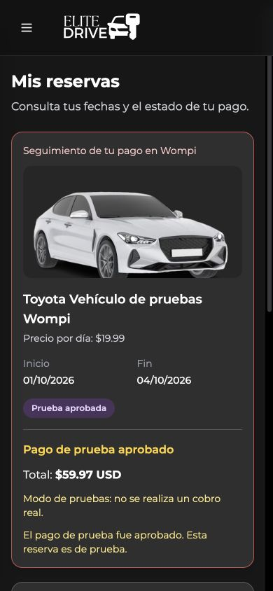

# Confirmación de pagos y reservas · 17 de septiembre de 2026

## Estado inicial

Proyecto local: `/Users/luisnativii/Desktop/Proyects/EliteDriverDocker`, rama `main`, commit inicial `34b154a` (`AddWompi`). El repositorio estaba limpio al comenzar la mejora funcional.

Se recuperó y auditó la conexión SSH al homelab. Proyecto desplegado: `/home/serverln/proyectos/EliteDriverDocker`, Compose `elitedriverdocker`, rama `main`, HEAD `60aa124`. Los cambios de la integración Wompi del despliegue anterior seguían en el directorio de trabajo del servidor; se verificaron sus huellas antes de actualizarlos. La versión ejecutada incluía esos cambios, por lo que HEAD por sí solo no identificaba todo el código desplegado.

La integración ya validaba las notificaciones firmadas y consultaba al proveedor, pero la pantalla del cliente solo consultaba una vez. La API devolvía `confirmado` para solicitudes pendientes y el administrador descartaba `paymentStatus`, calculando actividad e ingresos únicamente con fechas y montos.

La auditoría encontró **3 usuarios, 3 reservas pendientes y 12 vehículos**. Se revisaron contenedores, imágenes, puertos, redes, volúmenes, configuración con secretos protegidos, salud de PostgreSQL, esquema, registros y Git. PostgreSQL estaba saludable, con 14 columnas en reservas y el volumen existente `elitedriverdocker_postgres_data`.

Imágenes anteriores: backend `sha256:78ce4118c309ffb9b5322801bd53e9026fe54ce5b4ef860e5ecffbd058726c23`; frontend `sha256:167a4cf22796996098b3ae82a108c6b296e16b2cad96f09a5fa303f30839951c`. Puertos locales: web `5173`, API `18080`. Cloudflare continuaba enviando el dominio público a la web local.

## Cambios realizados

- Los enlaces nuevos regresan a «Mis reservas» con el identificador de la reserva. Los enlaces existentes también pueden retomar el seguimiento mediante un recuerdo temporal en la misma pestaña.
- Al regresar, la pantalla consulta el estado al servidor con intentos consecutivos y acotados, sin solicitudes de consulta simultáneas por reserva. La consulta vuelve a comprobarse al recuperar el foco. Hay verificación manual y se puede retomar un pago pendiente.
- La URL de retorno solo identifica qué reserva consultar. Un parámetro que diga `PAID` o `success` nunca confirma un pago.
- El servidor conserva la validación de firma, negocio, enlace, monto exacto, transacción y modo. El pago aprobado queda guardado y se reconoce tanto por notificación como por consulta a Wompi. Una operación rechazada o todavía sin confirmar sigue pendiente.
- La API distingue `pendiente_pago`, `confirmado`, `prueba_aprobada` y `cancelado`. Los registros antiguos sin un estado de pago se muestran pendientes hasta tener una confirmación válida.
- El administrador abre la vista **Confirmadas**, que solo incluye `PAID`. Las vistas **Pendientes de pago** y **Pruebas** permiten revisar los demás registros. El calendario, las reservas activas/próximas/completadas y los ingresos cuentan únicamente pagos reales aprobados. El panel se actualiza cada 30 segundos mientras está visible.
- Las reservas pagadas no ofrecen una cancelación automática que el servidor rechazaría; las pendientes sí pueden cancelarse. Se conservaron los bloqueos de disponibilidad existentes para solicitudes pendientes; cancelarlas libera las fechas.
- Se corrigieron el nombre del cliente y el tipo de vehículo en administración, las fechas mostradas en la zona local, y el día final del calendario.
- En móvil, administración presenta tarjetas. Reservas, filtros, detalles y menú caben en pantallas pequeñas, con botones de al menos 44 píxeles en los flujos de pago. El menú cerrado deja de ser interactivo. Se eliminó el bucle de una imagen de respaldo inexistente.
- El formulario de fechas del catálogo se adapta a 320 píxeles: los campos se apilan en pantallas pequeñas, tienen 44 píxeles de alto y texto de 16 píxeles. Sus etiquetas quedan asociadas a cada campo. La sincronización inicial del menú también comprueba el tamaño actual de pantalla.
- El catálogo conserva los bloqueos de fechas de las solicitudes pendientes y de prueba. La nueva etiqueta `pendiente_pago` no hace que una solicitud retenida se muestre disponible; solo cancelar libera las fechas. Esto conserva la regla existente del servidor y no convierte pendientes en activas.
- Las consultas periódicas ya no escriben nombres, DUI y correos de clientes en los registros del servidor.
- La construcción del frontend ejecutará las pruebas de reglas de pago antes de compilar. No se añadieron dependencias.

Las imágenes de vehículos, fotografías y logos existentes se conservaron. La captura incluida documenta una aprobación **simulada en la base local**, sin compra ni cobro real:



## Deploy

**Publicado y validado en [EliteDriver](https://elitedriver.luisnativii.site/).**

Se respaldaron configuración, `.env`, código completo aprobado, estado de Git, referencias Git, inventario, registros y PostgreSQL en:

`/home/serverln/backups/EliteDriverDocker/confirmation-20260917T234058Z`

El directorio tiene permisos privados. Se realizó un dump inicial y otro antes de cada activación. Todos los dumps se validaron con el listado del archivo y su lectura completa mediante `pg_restore`, sin restaurar ni modificar la base. El dump previo a la última activación ocupa 528,243 bytes y tiene SHA-256 `6e898b8d5f439d2fdd79f5537df0c5776276aceabb004c1b723a1ff166bfe290`.

Se construyeron backend y frontend consecutivamente sobre una copia del código existente del servidor, incorporando únicamente los cambios revisados. Las recetas temporales limitaron la memoria de Maven, sus pruebas y Node durante la construcción; esas opciones no pasan a las etapas de ejecución. Las pruebas se ejecutaron dentro de las construcciones, sin omitirlas.

Solo se recrearon `elitedriverdocker-backend-1` y `elitedriverdocker-frontend-1`, mediante Compose sin dependencias y esperando su salud. La revisión del catálogo y del arranque del menú requirió dos actualizaciones adicionales únicamente del frontend. Se conservaron las imágenes anteriores y las etiquetas de cada revisión, incluidas las etiquetas de recuperación `elitedriver-backend:before-confirmation-20260917T234058Z` y `elitedriver-frontend:before-confirmation-20260917T234058Z`.

| Servicio | Imagen final | SHA-256 de imagen | Contenedor final | Salud |
|---|---|---|---|---|
| backend | `elitedriver-backend:confirmation-20260917T234058Z` | `sha256:9bc0a73238ad27cef6af6d28663b14dd4ee4e6f7f121c58c54a950c18a40aeed` | `e8873e15f44f` | healthy |
| frontend | `elitedriver-frontend:confirmation-20260917T234058Z-mobile-final` | `sha256:e61601d4d16daf85429c14ae8c70a6005746bfec0abef74e3f03701b87832e97` | `d6ce0e128a1f` | healthy |

**PostgreSQL no fue reconstruido ni reiniciado:** conserva el contenedor `b46a34460945`, su hora de inicio `2026-09-17T14:19:49.278966015Z`, el volumen `elitedriverdocker_postgres_data`, sus montajes y su red. Los contenedores `cv-luisnativii` (`d9ae5478f700`) y `portainer` (`46f653ba1d20`) también mantienen sus identificadores, imágenes y horas de inicio. CV y Portainer respondieron HTTP 200; Cloudflare y el socket de Cockpit permanecen activos. Cloudflare conserva el proceso 2399 y la misma configuración.

**Sin migración nueva.** Las siete tablas, sus columnas y todas sus filas coinciden con las copias anteriores mediante SHA-256. Se conservaron 3 reservas, 3 usuarios, 12 vehículos, 101 características, 62 imágenes de vehículos, 4 tipos y 0 mantenimientos. Las 12 imágenes/assets originales del repositorio también coinciden con sus huellas.

Se conservaron `.env` con permisos 600, Compose, contraseñas, credenciales, dominios y configuración de Cloudflare. Wompi continúa en pruebas, con producción deshabilitada. No se crearon cuentas, reservas ni compras ficticias en el homelab.

La copia local se utilizó previamente para la prueba completa de una aprobación simulada; sus registros originales fueron restaurados. En el servidor se conservó la diferencia previa de galería en `VehiclesPage.jsx`: se aplicó únicamente el ajuste de disponibilidad, sin sustituir su galería por la variante local.

## Pruebas

- **34 pruebas del backend:** todas pasaron. Incluyen el contrato de estados de la API para pago real, prueba, pendiente, cancelado y valor antiguo nulo; URL de retorno y parámetros existentes; además de firma, monto, identidad, idempotencia y consulta de pagos a Wompi.
- **11 pruebas del frontend:** todas pasaron. Verifican que fechas vigentes no activen una reserva pendiente, que pruebas no sumen ingresos, límites del último día local, identificación del retorno, caducidad del recuerdo, aprobación y detención de consultas, respuestas lentas, consultas simultáneas y salida de la pantalla.
- **ESLint** en los archivos modificados y sus pruebas: sin errores ni advertencias. `git diff --check`: sin errores.
- **Maven package y Vite build** completados. Vite conserva el aviso por tamaño del paquete principal; no impidió la compilación.
- **Aplicación local real:** una reserva vigente sin pago quedó pendiente; el administrador mostró cero activas y cero ingresos, y separó la solicitud pendiente de la reserva de prueba.
- **Actualización sin recargar:** se abrió el retorno en estado pendiente y luego se envió una notificación firmada de aprobación simulada al servidor local. La misma pantalla pasó automáticamente a `PAID_TEST`, mostró la confirmación y retiró los botones de pago y cancelación.
- **URL manipulada:** `status=PAID` en el retorno no aprobó el pago; la aplicación mostró el estado pendiente que devolvía el servidor.
- **Móvil y tablet:** se verificaron anchos de 320, 390 y 768 píxeles. La página y el área principal no tuvieron desbordamiento horizontal. El detalle de reserva cabía a 320 píxeles; los botones de pago midieron 44–50 píxeles de alto.
- **Restauración local:** la reserva ficticia original coincide exactamente con su copia anterior y el usuario recuperó su rol original. Se eliminó la reserva auxiliar y la página temporal de prueba. El servidor y PostgreSQL respondieron `UP`.

**Comprobaciones de la versión publicada:**

- Las 34 pruebas del backend y las 11 del frontend pasaron en las construcciones del homelab: **45 en total**. La prueba adicional verifica que una pendiente retenga sus fechas sin estar activa ni sumar ingresos.
- Salud de API y PostgreSQL: `UP`. Web y dominio público: HTTP 200. Los recursos JavaScript y CSS públicos coinciden byte por byte con los archivos de la imagen final.
- El flujo público web → API → PostgreSQL devuelve los 12 vehículos. Las tres reservas existentes devuelven `PENDING` y `pendiente_pago`, con cero reservas pagadas y cero ingresos confirmados.
- Las rutas de pago requieren autenticación; un token inválido fue rechazado. Se validó la sesión contra la base con una credencial temporal de consulta, sin cambiar cuentas.
- Por el dominio público, una notificación de comprobación firmada y ajena a reservas existentes recibió HTTP 200. La misma notificación sin firma, con firma incorrecta y con cuerpo alterado recibió HTTP 401. Ninguna modificó datos de negocio.
- Desde el homelab se autenticó la cuenta ante Wompi y se comprobó el aplicativo: sigue en pruebas. No se generaron compras ni enlaces nuevos para esta comprobación.
- Catálogo público y navegación revisados en navegador a 320, 390 y 768 píxeles. El catálogo final no tuvo desbordamiento horizontal en la página ni en el área principal; todas las fotografías cargaron. A 320, ambos campos de fecha midieron 272 × 44 píxeles; el botón del menú mide 44 píxeles. El menú cerrado conserva `inert` y `aria-hidden`.
- Los registros de backend y frontend tras la activación no mostraron errores críticos; los contenedores del proyecto no registraron terminación por falta de memoria.

No se realizó una compra real ni se aprobó artificialmente una reserva del homelab. La aprobación completa se simuló únicamente en el entorno local. Si una pestaña abierta conserva los archivos anteriores, una recarga completa permite cargar la nueva versión; la revisión pública utilizó una URL con identificador de versión para evitar esa copia del navegador.

## Recursos

El homelab reporta **4 CPU y 5,7 GiB de RAM**. Construcciones consecutivas, sin servicios permanentes ni paquetes del sistema nuevos. Se conservaron PostgreSQL, redes, volúmenes y demás servicios.

Medición después de la última activación:

```text
total        used        free      shared  buff/cache   available
Mem:            5827        3300        1828          46        1047        2527
Swap:           3821          16        3805
elitedriverdocker-frontend-1 4.902MiB / 5.691GiB 0.17%
elitedriverdocker-backend-1 561MiB / 5.691GiB 0.15%
elitedriverdocker-postgres-1 30.13MiB / 5.691GiB 0.00%
cv-luisnativii 4.586MiB / 5.691GiB 0.00%
portainer 23.53MiB / 5.691GiB 0.02%
```

Las imágenes finales ocupan aproximadamente 124.6 MiB para backend y 22.1 MiB para frontend. Las imágenes anteriores se conservaron para recuperación; no se limpiaron volúmenes ni se detuvieron otros servicios.

## Git

Local: rama `main`, HEAD `34b154a`. Servidor: rama `main`, HEAD `60aa124`, con los cambios desplegados en su directorio de trabajo. No se crearon commits ni se enviaron cambios al remoto.

Las modificaciones existentes se identificaron antes de actualizar. En `VehiclesPage.jsx` se preservó la galería de cada entorno; el cambio nuevo únicamente adapta los bloqueos de disponibilidad a `paymentStatus`. Las imágenes de vehículos y los assets no se sustituyeron.

Archivos modificados o nuevos en esta mejora (27 de aplicación/pruebas, más este informe y su captura):

- [apps/EliteDriverBackendSoft/src/main/java/com/example/elitedriverbackend/controller/ReservationController.java](/Users/luisnativii/Desktop/Proyects/EliteDriverDocker/apps/EliteDriverBackendSoft/src/main/java/com/example/elitedriverbackend/controller/ReservationController.java)
- [apps/EliteDriverBackendSoft/src/main/java/com/example/elitedriverbackend/services/PaymentService.java](/Users/luisnativii/Desktop/Proyects/EliteDriverDocker/apps/EliteDriverBackendSoft/src/main/java/com/example/elitedriverbackend/services/PaymentService.java)
- [apps/EliteDriverBackendSoft/src/main/java/com/example/elitedriverbackend/services/ReservationService.java](/Users/luisnativii/Desktop/Proyects/EliteDriverDocker/apps/EliteDriverBackendSoft/src/main/java/com/example/elitedriverbackend/services/ReservationService.java)
- [apps/EliteDriverBackendSoft/src/test/java/com/example/elitedriverbackend/controller/ReservationControllerTest.java](/Users/luisnativii/Desktop/Proyects/EliteDriverDocker/apps/EliteDriverBackendSoft/src/test/java/com/example/elitedriverbackend/controller/ReservationControllerTest.java)
- [apps/EliteDriverBackendSoft/src/test/java/com/example/elitedriverbackend/services/PaymentServiceTest.java](/Users/luisnativii/Desktop/Proyects/EliteDriverDocker/apps/EliteDriverBackendSoft/src/test/java/com/example/elitedriverbackend/services/PaymentServiceTest.java)
- [apps/EliteDriverFrontEndSoft/Dockerfile](/Users/luisnativii/Desktop/Proyects/EliteDriverDocker/apps/EliteDriverFrontEndSoft/Dockerfile)
- [apps/EliteDriverFrontEndSoft/package.json](/Users/luisnativii/Desktop/Proyects/EliteDriverDocker/apps/EliteDriverFrontEndSoft/package.json)
- [apps/EliteDriverFrontEndSoft/src/components/admin/ReservationCalendar.jsx](/Users/luisnativii/Desktop/Proyects/EliteDriverDocker/apps/EliteDriverFrontEndSoft/src/components/admin/ReservationCalendar.jsx)
- [apps/EliteDriverFrontEndSoft/src/components/customer/FacturationDetail.jsx](/Users/luisnativii/Desktop/Proyects/EliteDriverDocker/apps/EliteDriverFrontEndSoft/src/components/customer/FacturationDetail.jsx)
- [apps/EliteDriverFrontEndSoft/src/components/layout/Header.jsx](/Users/luisnativii/Desktop/Proyects/EliteDriverDocker/apps/EliteDriverFrontEndSoft/src/components/layout/Header.jsx)
- [apps/EliteDriverFrontEndSoft/src/components/layout/Layout.jsx](/Users/luisnativii/Desktop/Proyects/EliteDriverDocker/apps/EliteDriverFrontEndSoft/src/components/layout/Layout.jsx)
- [apps/EliteDriverFrontEndSoft/src/components/layout/Sidebar.jsx](/Users/luisnativii/Desktop/Proyects/EliteDriverDocker/apps/EliteDriverFrontEndSoft/src/components/layout/Sidebar.jsx)
- [apps/EliteDriverFrontEndSoft/src/components/reservation/ReservationDetailModal.jsx](/Users/luisnativii/Desktop/Proyects/EliteDriverDocker/apps/EliteDriverFrontEndSoft/src/components/reservation/ReservationDetailModal.jsx)
- [apps/EliteDriverFrontEndSoft/src/components/reservation/ReservationPayment.jsx](/Users/luisnativii/Desktop/Proyects/EliteDriverDocker/apps/EliteDriverFrontEndSoft/src/components/reservation/ReservationPayment.jsx)
- [apps/EliteDriverFrontEndSoft/src/hooks/useLayout.js](/Users/luisnativii/Desktop/Proyects/EliteDriverDocker/apps/EliteDriverFrontEndSoft/src/hooks/useLayout.js)
- [apps/EliteDriverFrontEndSoft/src/hooks/useReservationManagement.js](/Users/luisnativii/Desktop/Proyects/EliteDriverDocker/apps/EliteDriverFrontEndSoft/src/hooks/useReservationManagement.js)
- [apps/EliteDriverFrontEndSoft/src/pages/admin/DashboardPage.jsx](/Users/luisnativii/Desktop/Proyects/EliteDriverDocker/apps/EliteDriverFrontEndSoft/src/pages/admin/DashboardPage.jsx)
- [apps/EliteDriverFrontEndSoft/src/pages/admin/ReservationManagementPage.jsx](/Users/luisnativii/Desktop/Proyects/EliteDriverDocker/apps/EliteDriverFrontEndSoft/src/pages/admin/ReservationManagementPage.jsx)
- [apps/EliteDriverFrontEndSoft/src/pages/customer/MyReservationsPage.jsx](/Users/luisnativii/Desktop/Proyects/EliteDriverDocker/apps/EliteDriverFrontEndSoft/src/pages/customer/MyReservationsPage.jsx)
- [apps/EliteDriverFrontEndSoft/src/services/paymentService.js](/Users/luisnativii/Desktop/Proyects/EliteDriverDocker/apps/EliteDriverFrontEndSoft/src/services/paymentService.js)
- [apps/EliteDriverFrontEndSoft/src/utils/paymentReturn.js](/Users/luisnativii/Desktop/Proyects/EliteDriverDocker/apps/EliteDriverFrontEndSoft/src/utils/paymentReturn.js)
- [apps/EliteDriverFrontEndSoft/src/utils/reservationStatus.js](/Users/luisnativii/Desktop/Proyects/EliteDriverDocker/apps/EliteDriverFrontEndSoft/src/utils/reservationStatus.js)
- [apps/EliteDriverFrontEndSoft/src/utils/watchPayment.js](/Users/luisnativii/Desktop/Proyects/EliteDriverDocker/apps/EliteDriverFrontEndSoft/src/utils/watchPayment.js)
- [apps/EliteDriverFrontEndSoft/tests/reservationStatus.test.js](/Users/luisnativii/Desktop/Proyects/EliteDriverDocker/apps/EliteDriverFrontEndSoft/tests/reservationStatus.test.js)
- [apps/EliteDriverFrontEndSoft/tests/watchPayment.test.js](/Users/luisnativii/Desktop/Proyects/EliteDriverDocker/apps/EliteDriverFrontEndSoft/tests/watchPayment.test.js)
- [docs/PAYMENT-CONFIRMATION-2026-09-17.md](/Users/luisnativii/Desktop/Proyects/EliteDriverDocker/docs/PAYMENT-CONFIRMATION-2026-09-17.md)
- [docs/screenshots/payment-confirmation-mobile.png](/Users/luisnativii/Desktop/Proyects/EliteDriverDocker/docs/screenshots/payment-confirmation-mobile.png)
- [apps/EliteDriverFrontEndSoft/src/components/forms/DateForm.jsx](/Users/luisnativii/Desktop/Proyects/EliteDriverDocker/apps/EliteDriverFrontEndSoft/src/components/forms/DateForm.jsx)
- [apps/EliteDriverFrontEndSoft/src/pages/customer/VehiclesPage.jsx](/Users/luisnativii/Desktop/Proyects/EliteDriverDocker/apps/EliteDriverFrontEndSoft/src/pages/customer/VehiclesPage.jsx)
